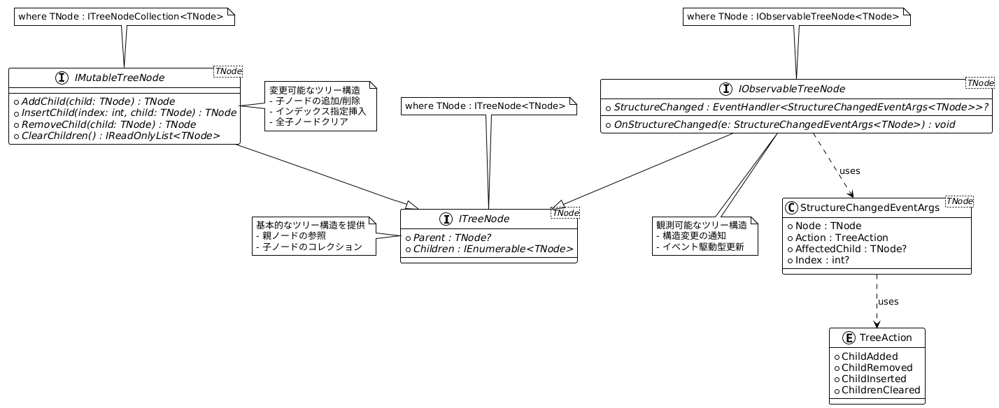

# NTree


#### 主要インターフェース

```plantuml
interface ITreeNode {}
interface IMutableTreeNode {}
interface IObservableTreeNode {}
```




#### 


#### 参考リポジトリ
- [Houzkin/TreeStructures](https://github.com/Houzkin/TreeStructures)
- 
- 
- 
