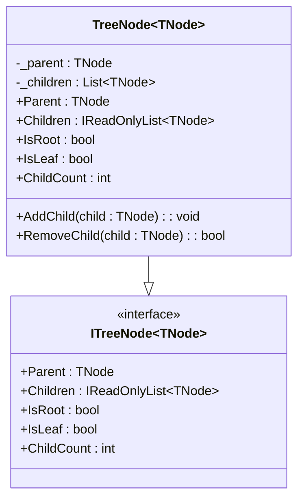

# NTree 基本クラス設計図

以下は、NTreeライブラリのコアとなるツリー構造のインターフェースと実装クラスのクラス図です。

---

## 解説
- **ITreeNode<TNode>**: ツリー構造の基本インターフェース。親・子・ノード状態（Root/Leaf）・子数を提供。
- **TreeNode<TNode>**: ITreeNode<TNode>を実装する基本クラス。親・子リストの管理、子の追加・削除メソッドを持つ。

ご要望に応じて拡張・修正可能です。 
